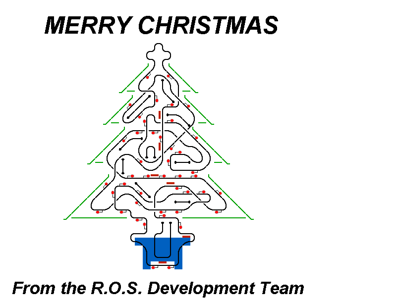

# O' Tannenbaum (Christmas Tree Map)

A special map for ROS with the focus being on watching the trains travelling around a Xmas tree changing the signal aspects like Christmas lights, as opposed to worrying about routing.

Merry Christmas everyone!

## Current Status

| Stage         | Status        |
| ------------- |:-------------:|
| Track Plan     |  |
| Signalling      |       |
| Naming |       |
| Speed Limits |  |
| Distances |  |
| Timetable |  |
| Documentation |  |

## Data Sources

- The North Pole Survey

Status icons by Freepik, pixelmeetup, Pixel Perfect on FlatIcon.com *do not remove this line*.
